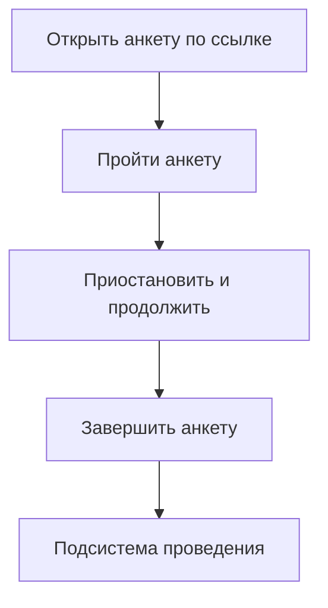
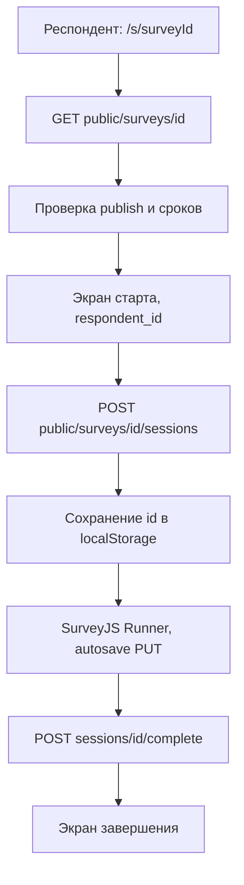
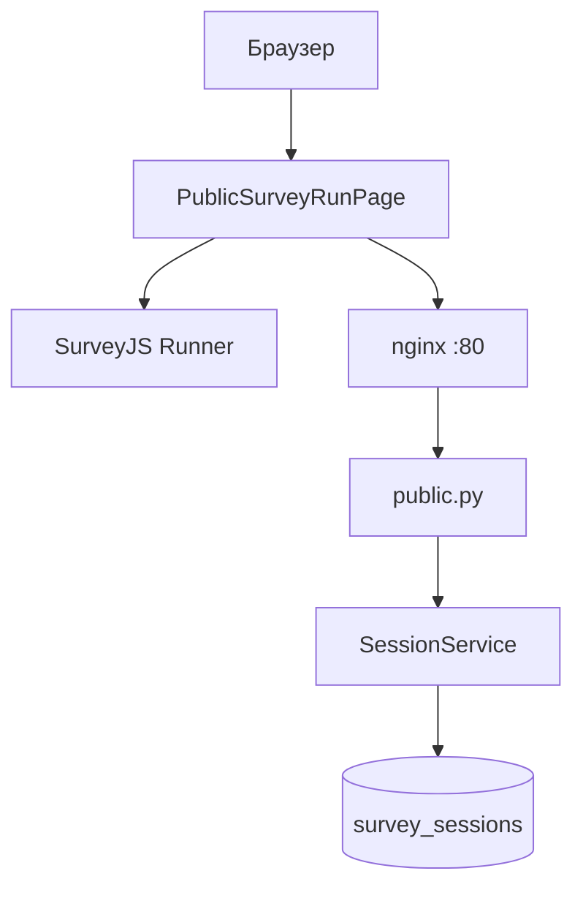

# Подсистема проведения анкетирования АСНИ социологических данных

Фрагмент пояснительной записки к выпускной квалификационной работе: назначение, требования, диаграммы, описание интерфейса и программной реализации подсистемы.

---

## 3. Подсистема проведения анкетирования

### 3.1. Назначение подсистемы и её место в архитектуре АСНИ

Подсистема проведения анкетирования берёт на себя всё, что происходит после публикации анкеты в конструкторе: загрузку схемы по идентификатору, экран для респондента, промежуточное сохранение ответов и фиксацию завершения.

Конструктор анкет и АРМ исследователя сюда не входят. Подсистема получает готовый survey_json и работает с записью сессии в таблице survey_sessions. Статистика и выгрузка для исследователя идут через защищённые маршруты /api/v1/surveys/..., но вызываются из административного интерфейса конструктора, а не с публичной страницы.

В реализованном прототипе есть следующее. Интерактивное прохождение: ветвление и скрытие вопросов по правилам SurveyJS на клиенте. Пауза и продолжение в рамках одного браузера: UUID сессии в localStorage и autosave на сервер. На сервер уходят процент прогресса и номер страницы. Проверяются сроки проведения, лимит завершённых ответов max_responses и флаг allow_anonymous. Интерфейс с логотипом ННГУ, русским текстом форм, переключением светлой и тёмной темы. В production подключены manifest и свой service worker для кэша статики. Тот же фронтенд отдаётся как Module Federation remote surveyConstructor, маршрут /s/:surveyId доступен и в автономном деплое, и внутри оболочки АСНИ.

---

### 3.2. Требования к подсистеме проведения анкетирования

#### 3.2.1. Функциональные требования

Обозначения: О обязательное, Ж желательное, В возможное.

Таблица 3.1. Функциональные требования

| ID | Формулировка требования | Приоритет |
|----|-------------------------|-----------|
| П.1.01 | Респондент открывает анкету по ссылке /s/{survey_id}; анкета видна только если is_published=true | О |
| П.1.02 | При первом старте создаётся сессия; UUID сохраняется в localStorage (ключ survey_session_{surveyId}) | О |
| П.1.03 | При повторном открытии в том же браузере восстанавливаются ответы, страница и прогресс из GET /public/sessions/{id} | О |
| П.1.04 | Ответы сохраняются на сервер при изменении полей и при смене страницы; debounce 700 мс | Ж |
| П.1.05 | По завершении сессия помечается завершённой, progress_pct=100 | О |
| П.1.06 | Ветвление и условия показа исполняются SurveyJS Runner на клиенте | О |
| П.1.07 | Завершённые и незавершённые сессии доступны исследователю через админский API | Ж |
| П.1.08 | Прогресс как доля заполненных видимых вопросов пересчитывается на клиенте и уходит на сервер | Ж |
| П.1.09 | Номер текущей страницы сохраняется для восстановления позиции | Ж |
| П.1.10 | При достижении max_responses по числу завершённых сессий новая сессия не создаётся (HTTP 403) | О |
| П.1.11 | Если allow_anonymous=false, без respondent_id сессия не стартует (клиент и 400 на сервере) | О |
| П.1.12 | При истечении срока сохранение прогресса блокируется (HTTP 403) | Ж |
| П.1.13 | На экране до старта респондент может ввести необязательный или обязательный идентификатор | Ж |
| П.1.14 | После завершения доступна кнопка Пройти заново: новая сессия, очистка localStorage | В |
| П.1.15 | Отдельные экраны для раннего старта и истечения срока (см. п. 3.8) | В |

#### 3.2.2. Нефункциональные требования

Таблица 3.2. Нефункциональные требования

| ID | Формулировка | Приоритет |
|----|----------------|-----------|
| П.2.01 | Маршруты /api/v1/public/* не требуют JWT | О |
| П.2.02 | В продакшене один origin для UI и API: nginx проксирует /api | Ж |
| П.2.03 | Debounce autosave 700 мс для снижения числа запросов | В |
| П.2.04 | Светлая и тёмная тема MUI и SurveyJS; theme_mode в localStorage | В |
| П.2.05 | Русская локализация SurveyJS (locale ru) | Ж |
| П.2.06 | Manifest и service worker для офлайн-оболочки статики в production | В |

---

### 3.3. Диаграмма прецедентов

На рисунке 3.1 прецеденты в одной колонке, без широких ответвлений. Подпись к рисунку: актор респондент. Экспорт PNG: https://mermaid.live, ширина около 400 px.

Рисунок 3.1. Диаграмма прецедентов подсистемы проведения

Актор: респондент. Порядок блоков на рисунке только для узкой вёрстки; прецеденты можно выполнять не строго по этой цепочке.

Респондент не проходит авторизацию в АСНИ. Достаточно ссылки /s/{id}. Открытие загружает опубликованную анкету. Прохождение включает ответы, переходы между страницами и autosave. Приостановить можно закрыв вкладку: при возврате в том же браузере сессия подтянется с сервера. Завершение фиксирует ответы и закрывает сессию для редактирования.

---

### 3.4. Диаграмма последовательности (основной сценарий)

На рисунке 3.2 узкая цепочка шагов основного сценария (новая сессия). Ветка восстановления из localStorage в тексте ниже.

Рисунок 3.2. Последовательность прохождения анкеты

Если в localStorage уже есть id сессии, после шага B выполняется GET public/sessions/id и пропускаются D, E, F (сразу Runner).

Страница PublicSurveyRunPage сначала тянет анкету. Если в localStorage лежит UUID прошлой сессии, подгружается её состояние; иначе показывается экран identify и кнопка начала. После POST sessions Runner получает hooks: при каждом изменении ответа или страницы через 700 мс уходит PUT. Complete отправляет финальный answers_json и переводит UI в done.

---

### 3.5. Диаграмма компонентов

На рисунке 3.3 компоненты идут одной узкой колонкой: от браузера к API и таблице сессий. Так схема обычно помещается на лист А4 без поворота. Экспорт PNG: https://mermaid.live (ширина около 350-450 px).

Рисунок 3.3. Компоненты подсистемы проведения

Клиентская часть, каталог frontend/src.

Публичное прохождение сосредоточено в PublicSurveyRunPage.tsx на маршруте /s/:surveyId. Это тот же React-бандл, что и у конструктора, но в App.tsx для pathname, начинающихся с /s/, верхний админский AppBar не рисуется. Человек с публичной ссылки не должен случайно попасть в список анкет или редактор.

Экран переключается полем stage: identify, running, done, expired, not_started. При открытии страницы срабатывает loadSurvey. Первый запрос GET /api/v1/public/surveys/{surveyId} возвращает заголовок, описание, survey_json и параметры проведения (allow_anonymous, start_date, end_date, starts_at, ends_at). Поля max_responses в этом ответе нет: лимит проверяется только при создании сессии, и респондент узнаёт о нём из текста ошибки.

Полученный survey_json загружается в экземпляр Model из survey-core. Русская локаль задаётся при импорте модуля (surveyLocalization.currentLocale = "ru") и повторно при каждой подгрузке. Включены showProgressBar = "top" и progressBarType = "questions". Ветвление, скрытие страниц и обязательность полей исполняет SurveyJS Runner (обёртка Survey из survey-react-ui); отдельного интерпретатора логики на сервере нет.

Если в localStorage уже лежит UUID под ключом survey_session_{surveyId}, страница вызывает GET /public/sessions/{id}. Завершённая сессия сразу переводит в done. Незавершённая подставляет answers_json и current_page в модель, восстанавливает progress_pct, вешает attachHooks и открывает running без экрана старта. Невалидный или удалённый на сервере id из хранилища вычищается, пользователь возвращается на identify.

На стадии identify показывают карточку с названием, описанием и датой окончания (end_date или ends_at, через formatSurveyLocale в ru-RU). TextField для respondent_id. Если allow_anonymous = false, handleStart без непустого значения не шлёт POST и выводит сообщение на русском. Успешный старт создаёт сессию, пишет id в localStorage, обнуляет model.data и currentPageNo и переходит в running.

В running над формой стоит LinearProgress MUI. Функция updateProgress считает только видимые вопросы (getAllQuestions(false)) и долю заполненных. attachHooks перед навешиванием снимает старые обработчики onValueChanged, onCurrentPageChanged и onComplete. Любое изменение ответа или страницы пересчитывает прогресс и запускает scheduleSave: таймер window.setTimeout на 700 мс, затем PUT /public/sessions/{id} с телом answers_json (model.data), current_page (model.currentPageNo) и progress_pct. Сбой сети при autosave не ломает форму, но попадает в Alert с текстом про проверку подключения.

По onComplete уходит POST /public/sessions/{id}/complete с финальным sender.data, progress становится 100, stage переключается в done. Экран завершения благодарит респондента и при наличии показывает введённый идентификатор. handleRestart удаляет ключ localStorage, сбрасывает session и respondentId, заново поднимает survey_json из pub и возвращает на identify, чтобы можно было пройти анкету ещё раз (новая сессия на сервере).

Обработка ошибок в loadSurvey и handleStart смотрит на код HTTP. Ветка expired завязана на 410; на практике чаще приходит 403 со строкой Survey has ended, и пользователь видит Alert, а не отдельную страницу. Для раннего старта заложен stage not_started с опросом loadSurvey раз в 15 секунд, но сервер пока отвечает plain-текстом Survey has not started yet без JSON с полем code, поэтому этот режим почти не включается (см. п. 3.7).

applySurveyTheme после появления узла .sd-root-modern подменяет CSS-переменные тем DefaultLight и DefaultDark на оттенки фирменного #003399. Переключатель в шапке идёт через useThemeMode из ThemeContext.tsx вместе с остальным приложением; theme.ts задаёт палитру MUI.

UnnLogo.tsx рисует шапку с подписью про анкетирование ННГУ. В index.html подключён manifest.webmanifest; main.tsx в production регистрирует service worker /sw.js (кэш иконок и оболочки, для навигации network-first). Без сети можно открыть оболочку, но черновик ответов на сервер не уедет.

Сборка через Vite с Module Federation: remote surveyConstructor отдаёт тот же код в оболочку АСНИ. Вспомогательный publicSurveyLink.ts формирует абсолютную ссылку /s/{id} для AdminSurveysListPage и редактора. Тип PublicSurvey в api.ts описывает поля публичного GET; админские методы по-прежнему ходят с Bearer из localStorage.

Серверная часть, каталог backend/app.

Публичный контур вынесен в app/api/v1/public.py. Префикс роутера /public, JWT не запрашивается. Тонкий слой: валидация UUID, разбор Pydantic-схем SessionCreate, SessionSave, SessionComplete и вызов SessionService или SurveyService.

| Метод | Путь | Назначение |
|-------|------|------------|
| GET | /public/surveys/{survey_id} | Опубликованная анкета и survey_json для Runner |
| POST | /public/surveys/{survey_id}/sessions | Создание сессии, тело { respondent_id } |
| GET | /public/sessions/{session_id} | Чтение сессии для восстановления в браузере |
| PUT | /public/sessions/{session_id} | Autosave: answers_json, current_page, progress_pct |
| POST | /public/sessions/{session_id}/complete | Финальная фиксация ответов |

GET public/surveys отдаёт id, title, description, survey_json, version, start_date, end_date, allow_anonymous, starts_at, ends_at в ISO. max_responses в JSON нет.

SurveyService.get_public_survey проверяет доступность анкеты для респондента. Неопубликованная даёт 404 с текстом Survey not found or not published. Если текущее время раньше окна приёма, 403 Survey has not started yet. Если позже конца, 403 Survey has ended. Учитываются обе пары полей: starts_at вместе с start_date (берётся max), ends_at вместе с end_date (берётся min), чтобы совпадать с тем, что задаёт конструктор в диалоге сроков.

SessionService.start_session сначала вызывает get_public_survey, затем при заданном max_responses сравнивает completed_response_count с лимитом. При превышении 403 Survey has reached the maximum number of responses. Если allow_anonymous = false и respondent_id пустой, 400 This survey requires a respondent identifier. В таблицу survey_sessions пишется строка с пустым answers_json, current_page = 0, progress_pct = 0.

save_progress загружает сессию по UUID. Завершённую менять нельзя (400 Session already completed). answers_json проходит _validate_answers: только объект со строковыми ключами. Перед записью снова читается анкета и сверяется конец окна (min из ends_at и end_date); при нарушении 403 Survey has ended — no further changes allowed. Обновляются answers_json, current_page, progress_pct (ограничен 0..100), last_saved_at.

complete_session записывает финальный answers_json, ставит is_completed = true, progress_pct = 100, completed_at и last_saved_at. Повторной проверки срока на этом шаге в текущей версии нет.

ORM-модель survey_sessions (app/models/session.py): внешний ключ survey_id с ON DELETE CASCADE, respondent_id до 100 символов, answers_json типа JSONB, флаги is_completed, метки completed_at и last_saved_at, целочисленный current_page, вещественный progress_pct, служебные created_at и updated_at.

Записи той же таблицы читает подсистема-конструктор: GET /surveys/{id}/sessions, GET /surveys/{id}/stats, GET /surveys/{id}/export с параметрами format, anonymize, include_incomplete. Респондент к этим маршрутам не обращается.

В production контейнер survey-frontend на порту 80 отдаёт index.html для SPA и проксирует /api на survey-api:8000. В dev Vite на 5173 с proxy /api на 8001. Эндпоинт GET /api/v1/info объявляет capability survey-respond для родительской системы АСНИ.

Скрипты e2e_public_flow.py и e2e_stats_and_export.py в CI поднимают Docker-стек и гоняют полный цикл: старт, два PUT с разным progress_pct, complete, проверка через public GET и админский список; затем stats и export с anonymize. Отдельные сценарии на границы сроков и max_responses в E2E пока не вынесены.

---

### 3.6. Взаимодействие с подсистемой-конструктором

Конструктор задаёт survey_json, выставляет is_published и поля проведения: starts_at, ends_at, start_date, end_date, max_responses, allow_anonymous. Подсистема проведения только читает их и пишет survey_sessions.

Если исследователь изменил схему после того, как люди уже отвечали, старые сессии хранят answers_json в старой разметке. Отдельного версионирования ответов по волнам опроса в MVP нет. Публичную ссылку копируют из AdminSurveysListPage или AdminSurveyEditorPage после publish.

---

### 3.7. Ограничения и допущения (MVP)

Сессия привязана к браузеру. Другой компьютер или очистка localStorage не восстановит черновик без отдельного механизма вроде персональной ссылки с токеном.

В одном браузере на анкету один активный черновик. После Пройти заново создаётся новая сессия.

Коды сроков. Backend отдаёт 403 и текстовый detail, не 410. Стадия expired в UI рассчитана на 410, на практике пользователь видит Alert с Survey has ended.

Экран ещё не началось. Frontend ждёт JSON с code survey_not_started. Сервер пока шлёт строку. Автоопрос раз в 15 с на not_started без доработки API почти не работает.

Лимит ответов. Респондент узнаёт о max_responses только при ошибке POST sessions, не на карточке анкеты.

Complete без повторной проверки срока. Теоретически можно завершить после закрытия окна, если сессия уже открыта.

PWA кэширует оболочку, но не гарантирует отправку ответов без сети.

Отдельного мобильного приложения нет, достаточно браузера.

---

Конец фрагмента. Номера рисунков и таблиц при вставке в пояснительную записку привести к сквозной нумерации. Диаграммы Mermaid экспортируются на https://mermaid.live.
