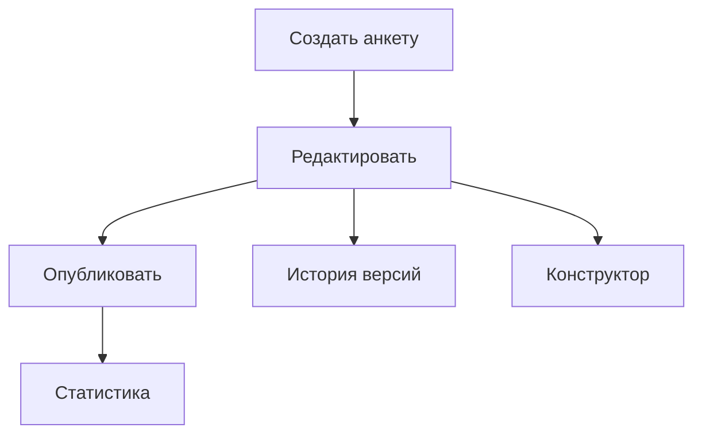
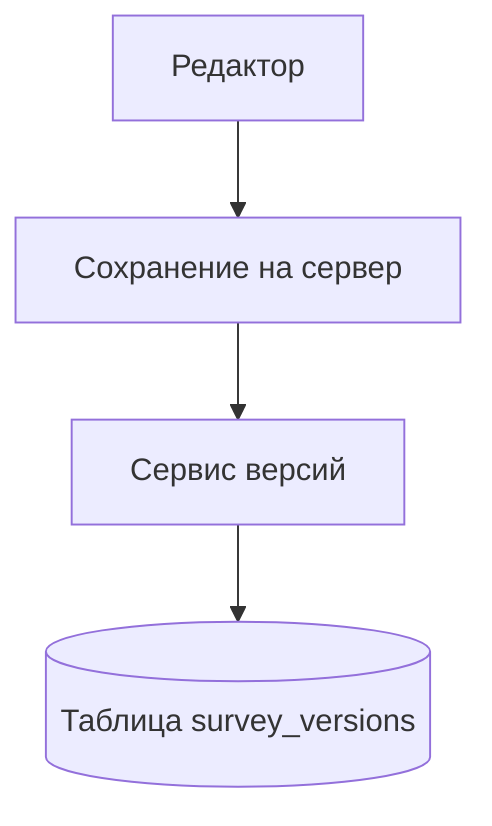
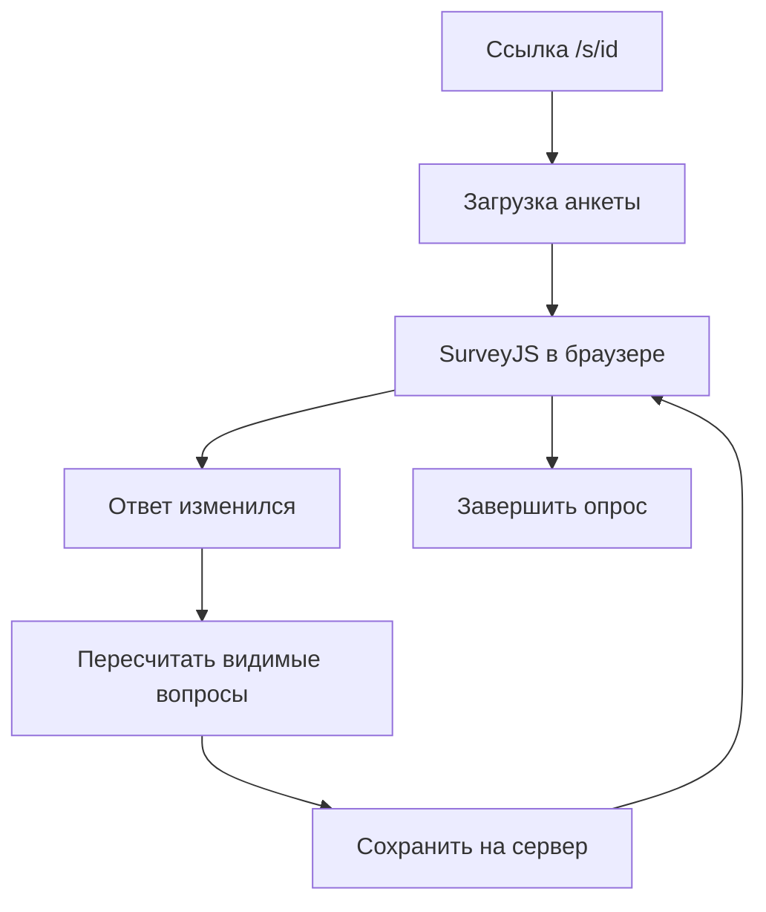
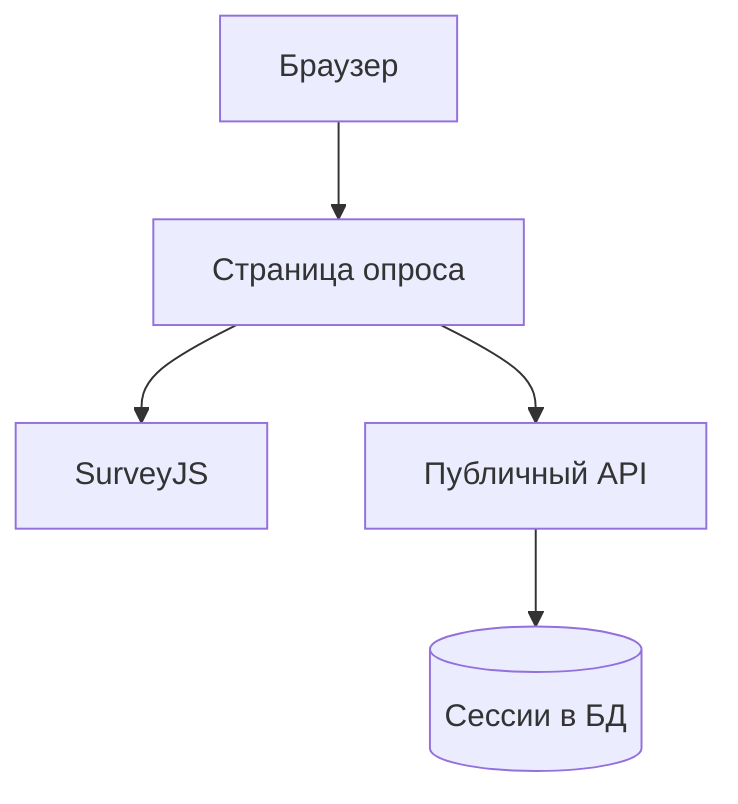
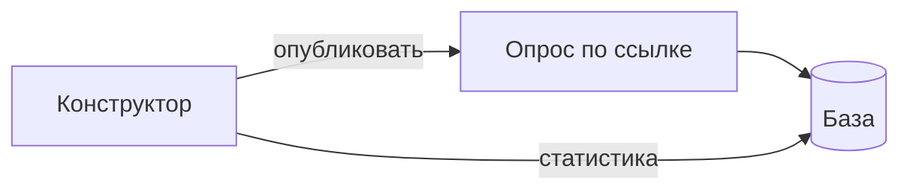

# Презентация к защите ВКР (около 5–6 минут, 8 слайдов + титул)

Один блок «Слайд N» = один слайд. Mermaid → PNG на https://mermaid.live (~1000 px).

**Принцип:** на слайде — минимум слов; в речи — простым языком, технические детали только вкратце (один-два термина на слайд, не перечислять всё подряд).

---

## Слайд 1. Титул

**На слайде:**

- Выпускная квалификационная работа
- Конструктор и проведение анкетирования
- [ФИО], ННГУ ИИТММ, 2026

**Текст выступления:**

Здравствуйте, меня зовут [ФИО]. Тема: конструктор анкет и проведение опроса для исследователя и респондента. Сделан рабочий прототип на React, FastAPI и PostgreSQL, в Docker. Дальше по слайдам: что умеет каждая часть, версии анкеты, динамика, немного кода и итог.

---

## Слайд 2. Подсистема-конструктор анкетирования

**На слайде:**

- Собрать анкету в редакторе
- Опубликовать и получить ссылку
- Посмотреть ответы и скачать файл

**Диаграмма (прецеденты, из ВКР):**



**Текст выступления:**

Конструктор — это то, с чем работает исследователь после входа. Видит список анкет, открывает редактор SurveyJS Creator: страницы, вопросы, вкладка «Логика». Черновик сам сохраняется на сервер примерно раз в секунду, схема лежит в поле survey_json. Когда готово, жмёт «Опубликовать» и получает ссылку вида /s/ и идентификатор анкеты.

Можно задать сроки приёма ответов и лимит, разрешить или запретить анонимное прохождение. Потом смотреть статистику и скачать CSV или JSON. Респондент здесь ничего не заполняет — только подготовка и контроль. Студент с ролью student список видит, но не редактирует.

---

## Слайд 3. Версионирование анкет

**На слайде:**

- Каждое сохранение попадает в журнал
- Видно, что и когда меняли
- Можно вернуть прошлую версию

**Диаграмма:**



**Текст выступления:**

Это то, что я бы отдельно выделила. Пока исследователь правит анкету, сервер не просто затирает старое, а пишет версию в журнал survey_versions: кто менял, когда, кратко что изменилось. Справа в редакторе панель «История версий» — список сохранений, можно раскрыть diff.

Ошиблись — выбираете прошлую версию, подтверждаете, схема возвращается. Старое не пропадает: в журнале остаётся запись, что это восстановление с номера N. На сервере за это отвечает SurveyVersionService, на слайде с кодом будет метод restore_version.

Зачем это в опросе: анкету часто допиливают уже во время сбора. Без журнала потом непонятно, на какой текст вопроса человек отвечал.

---

## Слайд 4. Динамическое анкетирование

**На слайде:**

- Вопросы зависят от ответов
- Настраивает исследователь
- Работает у респондента в браузере

**Диаграмма:**



**Текст выступления:**

Второй важный момент — динамическая анкета. Исследователь в конструкторе задаёт правила: показать вопрос только если, например, в первом выбрали «да». Это условия visibleIf в SurveyJS. При опросе тот же файл survey_json читает Runner в браузере, страница не перезагружается.

Если человек меняет ответ, часть вопросов может спрятаться или появиться. Процент «сколько заполнено» считается только по видимым сейчас вопросам, иначе после ветвления полоска прогресса врала бы. Один JSON на редактор и на опрос — не нужно два разных описания анкеты.

---

## Слайд 5. Подсистема проведения анкетирования

**На слайде:**

- Опрос по ссылке, без пароля
- Ответы сохраняются сами
- Можно продолжить позже в том же браузере

**Диаграмма (из ВКР):**



**Текст выступления:**

Проведение — страница PublicSurveyRunPage, ссылка /s/ и id анкеты. Без пароля: публичный API на сервере, отдельно от админки.

Человек открывает ссылку, при необходимости вводит имя, отвечает. На сервере создаётся сессия — одна попытка; её номер запоминается в localStorage браузера. Ответы улетают сами, с паузой около 0,7 секунды, чтобы не слать запрос на каждый клик. Закрыл вкладку, открыл снова в том же браузере — подтянется с сервера. В конце «завершить», сессия закрывается.

Сервер не пустит, если анкета не опубликована, срок вышел или уже набрали максимум ответов. Ответы лежат в таблице survey_sessions в PostgreSQL.

---

## Слайд 6. Пример кода: возврат версии

**На слайде:**

- Код на сервере: откат версии анкеты

**Код:**

```python
async def restore_version(self, survey, version_id, user):
    target = await self.get_version(survey.id, version_id)
    snapshot = target.survey_json_snapshot or {}
    if "survey_json" in snapshot:
        survey.survey_json = snapshot["survey_json"]
    survey.version += 1
    await self._record_version(
        survey,
        changes={"action": "restored", "from_version": target.version_number},
        ...
    )
```

**Текст выступления:**

На слайде кусок Python с сервера. Берётся сохранённый снимок анкеты из журнала, подставляется в рабочую запись, номер версии увеличивается. В changes пишется, что это восстановление и с какой версии. В интерфейсе это кнопка в панели истории версий и диалог «вы уверены?».

---

## Слайд 7. Пример кода: autosave при опросе

**На слайде:**

- Код в браузере: сохранение ответов

**Код:**

```typescript
const visible = model.getAllQuestions(false).filter((q) => q.isVisible);
const pct = ... // сколько из видимых уже заполнено
await api.put(`/public/sessions/${sessionId}`, {
  answers_json: model.data,
  current_page: model.currentPageNo,
  progress_pct: pct,
});
// вызывается через 700 мс после изменения ответа
```

**Текст выступления:**

Здесь фронтенд при опросе. После изменения ответа с небольшой задержкой уходит запрос на сервер: ответы, номер страницы, процент заполнения. В коде видно главное — берутся только видимые вопросы, это как раз связка с динамикой на прошлом слайде. Отправка не на каждый символ, а через 700 миллисекунд.

---

## Слайд 8. Итоги

**На слайде:**

- Конструктор + проведение: полный цикл опроса
- Версии анкеты и умные вопросы
- Спасибо за внимание

**Диаграмма:**



**Текст выступления:**

Итого. Цель работы выполнена: исследователь собирает и публикует анкету, респондент отвечает по ссылке, всё в одной базе PostgreSQL. Полный цикл: редактор, публикация, опрос, статистика, выгрузка.

Два результата, которые для меня главные: журнал версий схемы анкеты и динамические вопросы при прохождении. Прототип в Docker, есть автотесты API в CI.

Честно про минус: продолжить незаконченный опрос на другом компьютере пока нельзя, сессия привязана к браузеру. Спасибо за внимание, готова ответить на вопросы.

---

## Хронометраж

| Слайд | Тема | ~сек |
|-------|------|------|
| 1 | Титул | 25 |
| 2 | Конструктор | 40 |
| 3 | Версионирование | 45 |
| 4 | Динамика | 45 |
| 5 | Проведение | 40 |
| 6 | Код: версии | 30 |
| 7 | Код: autosave | 25 |
| 8 | Итоги | 35 |
| **Σ** | | **~5 мин** |

---

## Если спросят

**Версия и сессия?** Версия — как менялась анкета (журнал survey_versions). Сессия — ответы одного человека (таблица survey_sessions).

**Почему SurveyJS?** Один JSON на редактор и на опрос.

**Демо?** docker compose up, /admin/surveys, опубликовать, открыть /s/... в другой вкладке.
