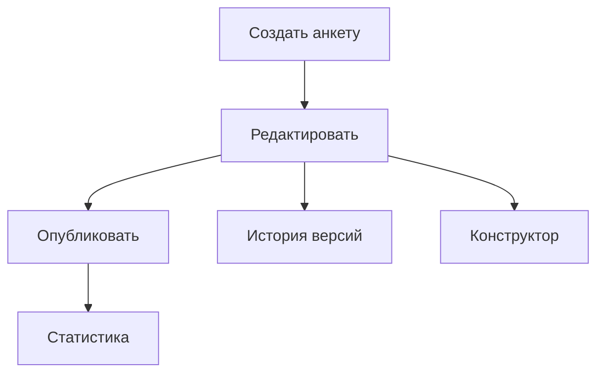
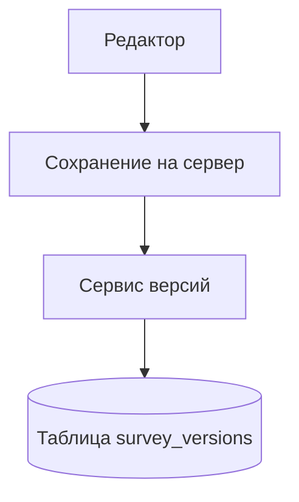
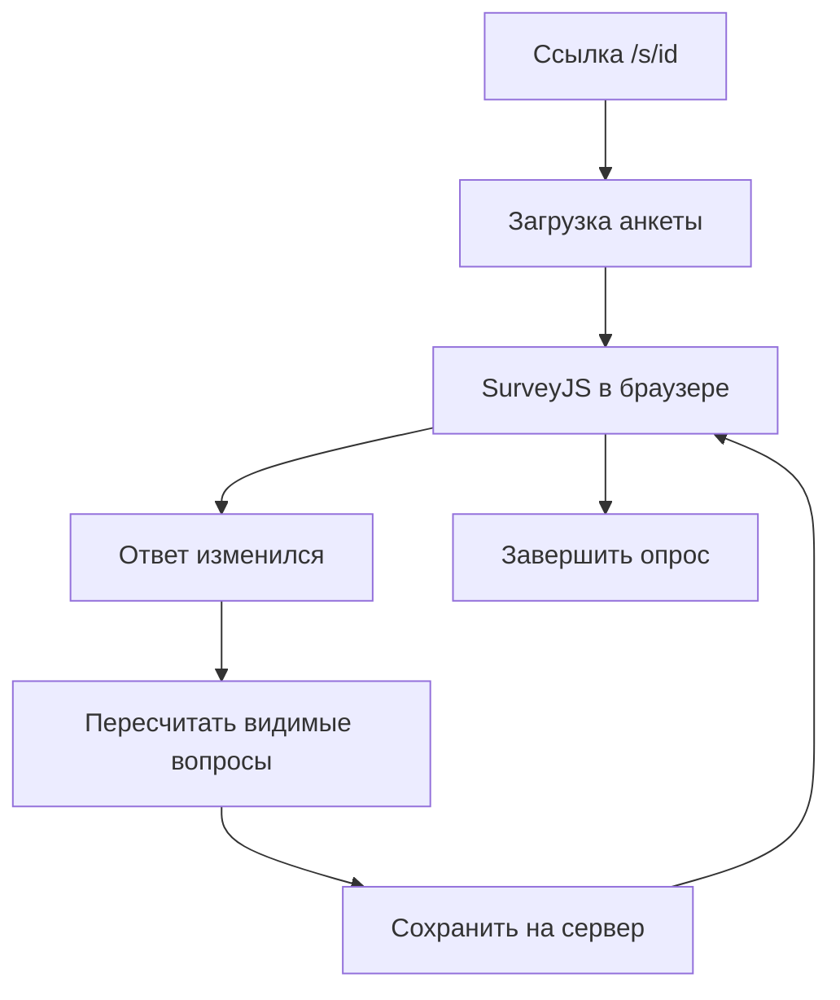
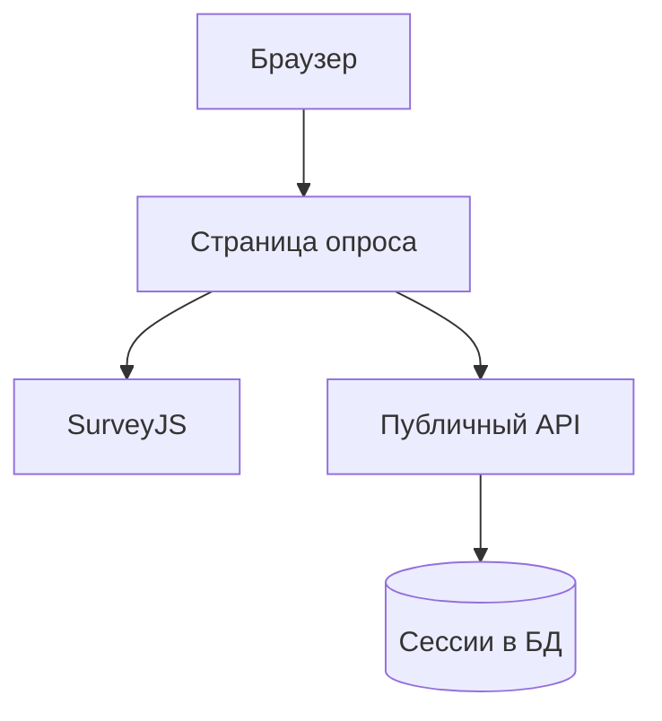
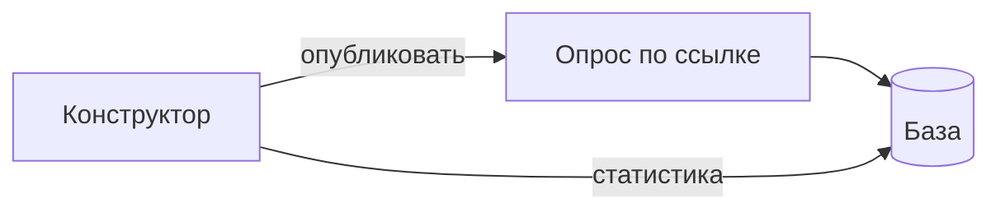

# Презентация к защите ВКР (около 5 минут, 8 слайдов + титул)

Тема: подсистема-конструктор и подсистема проведения анкетирования.

Один блок «Слайд N» = один слайд. Mermaid → PNG на https://mermaid.live (ширина ~1000 px).

---

## Слайд 1. Титул

**На слайде:**

- Выпускная квалификационная работа
- Подсистема-конструктор и подсистема проведения анкетирования
- [ФИО], группа [номер], ННГУ ИИТММ, 2026
- React, FastAPI, PostgreSQL, Docker

**Текст выступления:**

Здравствуйте. Я [ФИО]. В работе две связанные части: конструктор, где исследователь собирает анкету, и проведение, где респондент отвечает по ссылке. Сделала рабочий прототип и описала его в записке. Сейчас по слайдам: что умеет каждая подсистема, версии анкеты, динамика при опросе, кусочки кода и итог.

---

## Слайд 2. Подсистема-конструктор анкетирования

**На слайде:**

- Для исследователя (вход в /admin/surveys)
- SurveyJS Creator: вопросы, страницы, вкладка «Логика»
- Автосохранение черновика, публикация, ссылка /s/{id}
- Сроки опроса, лимит ответов, анонимность да/нет
- Статистика и выгрузка CSV/JSON

**Диаграмма (прецеденты, из ВКР):**



**Текст выступления:**

Конструктор — это «кухня» анкеты. Исследователь заходит под логином, видит список опросов, открывает редактор. Там мышкой набирает вопросы, без программирования. Можно задать, с какого числа принимать ответы и когда закрыть. Когда всё готово, жмёт «Опубликовать» и получает ссылку для людей. Тут же можно посмотреть, сколько человек ответило, и скачать файл. Сбор ответов на этой странице не идёт — только подготовка и контроль.

---

## Слайд 3. Версионирование анкет

**На слайде:**

- При сохранении: снимок survey_json в survey_versions
- Видно: номер версии, кто правил, что изменилось (diff)
- Можно вернуть старую версию (панель справа в редакторе)
- Откат не стирает журнал: пишется «восстановлено с версии N»
- Зачем: анкету часто правят уже во время опроса

**Диаграмма:**



**Текст выступления:**

Это то, что я бы отдельно назвала на защите. Пока исследователь правит анкету, сервер не просто затирает старое, а кладёт версию в журнал. Справа в редакторе список: когда, кто, что поменял. Ошиблись — выбираете прошлую версию, подтверждаете, схема возвращается. Старое при этом не пропадает: в журнале остаётся запись про восстановление. На практике анкеты допиливают в процессе поля; без версий потом непонятно, на какой текст вопроса человек отвечал.

---

## Слайд 4. Динамическое анкетирование

**На слайде:**

- Вопросы показываются или прячутся от ответов респондента
- Правила задаёт исследователь в Creator (visibleIf)
- Работает в браузере: SurveyJS Runner
- Один survey_json и для редактора, и для опроса
- Прогресс считается только по видимым вопросам

**Диаграмма:**



**Текст выступления:**

Второй важный момент — «умная» анкета для респондента. Например: показать блок вопросов только если в первом выбрали «да». Это настраивается в конструкторе, а при опросе выполняется в браузере, страница не перезагружается. Описание одно — файл survey_json. И процент «сколько заполнено» считается не по всей анкете, а только по тем вопросам, которые человек сейчас видит. Иначе после ветвления прогресс-бар врал бы.

---

## Слайд 5. Подсистема проведения анкетирования

**На слайде:**

- Респондент: ссылка /s/{id}, без пароля
- Экран старта, опрос, завершение
- Сессия в БД + id в localStorage браузера
- Autosave ~0,7 с: ответы, страница, процент
- Можно прерваться и вернуться в том же браузере
- Проверки: опубликована, срок, лимит ответов

**Диаграмма (из ВКР):**



**Текст выступления:**

Проведение — всё для респондента. Человек открывает ссылку, при необходимости вводит имя, отвечает на вопросы. На сервере заводится сессия — одна попытка прохождения. Номер сессии запоминается в браузере. Ответы улетают сами, с небольшой паузой, чтобы не ддосить сервер кликами. Закрыл ноутбук — открыл снова в том же браузере — подтянется с сервера. В конце «завершить», сессия закрывается. Сервер не пустит, если анкета не опубликована, срок вышел или уже набрали максимум ответов.

---

## Слайд 6. Пример кода: возврат версии

**На слайде:**

- Файл: backend/app/services/survey_version_service.py
- Функция restore_version: восстановление схемы анкеты из журнала
- Берётся снимок survey_json из выбранной версии
- Номер версии увеличивается; в журнал пишется action: restored
- В интерфейсе: VersionHistoryPanel → «Восстановить» → диалог подтверждения

**Код:**

```python
async def restore_version(self, survey, version_id, user):
    target = await self.get_version(survey.id, version_id)
    snapshot = target.survey_json_snapshot or {}
    if "survey_json" in snapshot:
        survey.survey_json = snapshot["survey_json"]
    survey.version += 1
    await self._record_version(
        survey,
        changes={"action": "restored", "from_version": target.version_number},
        ...
    )
```

**Текст выступления:**

На слайде серверный код отката. Берётся снимок из survey_versions, подставляется в анкету, version увеличивается, в журнал пишется, что это восстановление. В интерфейсе это панель «История версий» и кнопка с подтверждением.

---

## Слайд 7. Пример кода: autosave при опросе

**На слайде:**

- Файл: frontend/src/pages/PublicSurveyRunPage.tsx
- После изменения ответа: пауза 700 мс, затем PUT на сервер
- getAllQuestions(false) + isVisible — только показанные вопросы
- На сервер: answers_json, current_page, progress_pct
- Скрытый вопрос не входит в процент заполнения

**Код:**

```typescript
const visible = model.getAllQuestions(false).filter((q) => q.isVisible);
const pct = ... // сколько из видимых уже заполнено
await api.put(`/public/sessions/${sessionId}`, {
  answers_json: model.data,
  current_page: model.currentPageNo,
  progress_pct: pct,
});
// вызывается через 700 мс после изменения ответа
```

**Текст выступления:**

Здесь фронт при опросе. Считаются только видимые вопросы — это как раз связка с динамикой. Отправка не на каждый символ, а через 700 миллисекунд после изменения.

---

## Слайд 8. Итоги

**На слайде:**

- Сделаны конструктор и проведение: от редактора до выгрузки ответов
- Сценарий: собрать → опубликовать → опрос по ссылке → статистика, CSV/JSON
- Версионирование: журнал правок анкеты, откат без потери истории
- Динамика: ветвление в браузере, один survey_json
- Ограничение: черновик опроса только в том же браузере (localStorage)
- E2E-тесты в CI. Спасибо за внимание, вопросы?

**Диаграмма:**



**Текст выступления:**

Итого. Цель работы выполнена: исследователь собирает и публикует анкету, респондент отвечает по ссылке, данные в PostgreSQL. Два результата, которые для меня главные: журнал версий схемы и динамические вопросы при прохождении. Честно про минус: продолжить незаконченный опрос на другом компьютере пока нельзя. Спасибо, готова ответить на вопросы.

---

## Хронометраж

| Слайд | Тема | ~сек |
|-------|------|------|
| 1 | Титул | 25 |
| 2 | Конструктор | 40 |
| 3 | Версионирование | 45 |
| 4 | Динамика | 45 |
| 5 | Проведение | 40 |
| 6 | Код: версии | 30 |
| 7 | Код: autosave | 25 |
| 8 | Итоги | 35 |
| **Σ** | | **~5 мин** |

---

## Если спросят

**Версия и сессия?** Версия — как менялась анкета. Сессия — ответы одного человека.

**Почему SurveyJS?** Один JSON на редактор и на опрос.

**Демо?** docker compose up, /admin/surveys, publish, открыть /s/... в другой вкладке.
