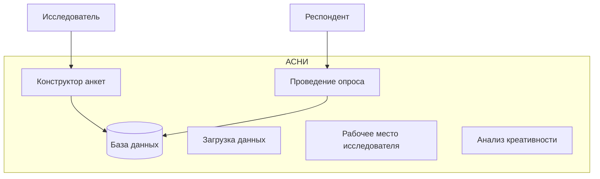
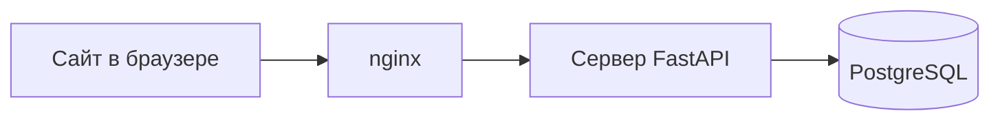
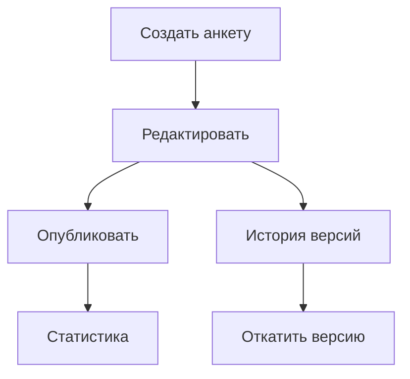
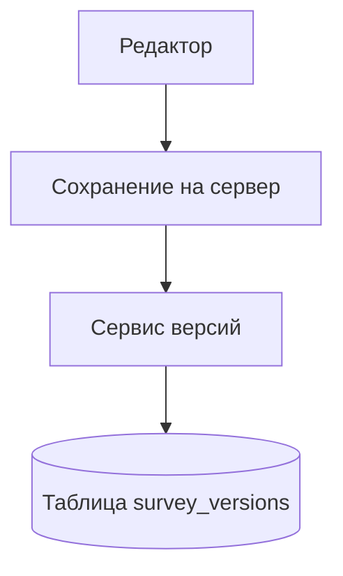
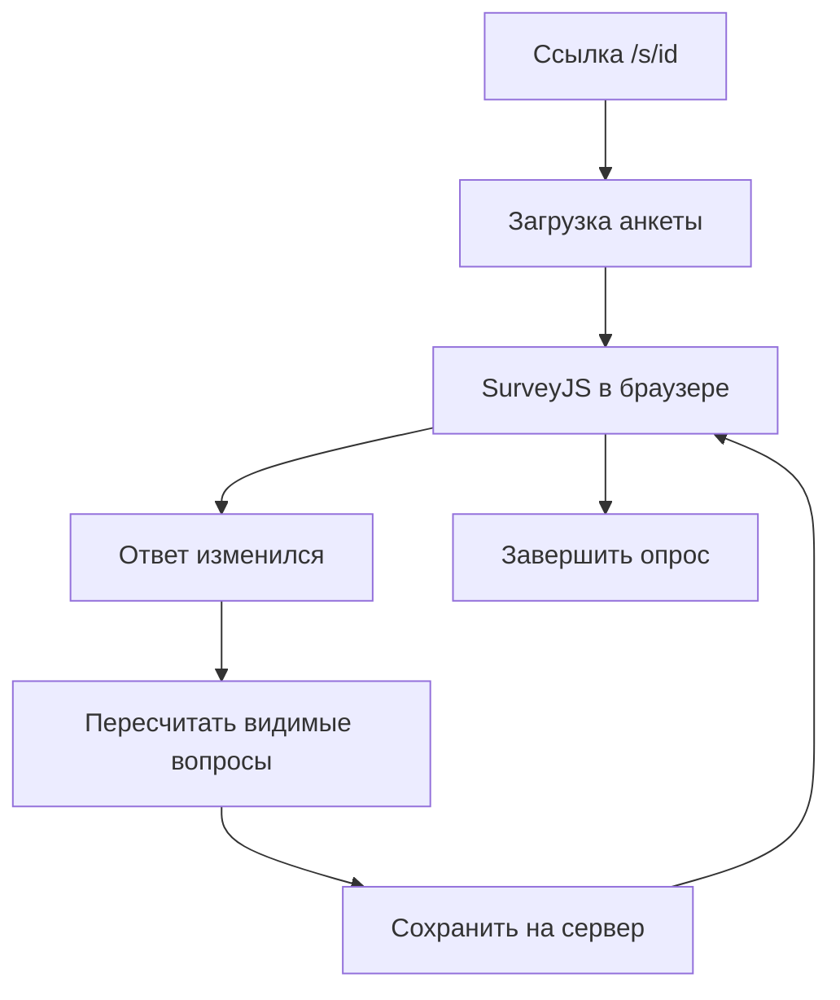
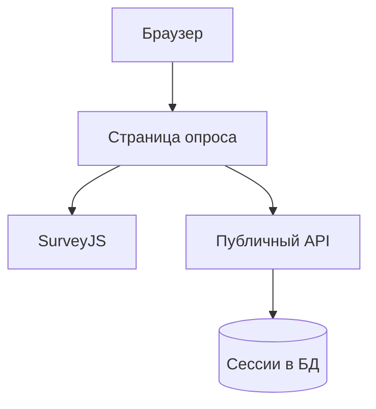
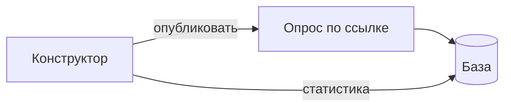

# Презентация к защите ВКР (около 5–6 минут, 10 слайдов)

Тема: конструктор анкет и проведение опроса в АСНИ.

Как перенести в PowerPoint или Google Slides: один блок «Слайд N» = один слайд. Картинки из Mermaid: https://mermaid.live, ширина примерно 1000 px. Код на слайд — скрин или вставка шрифтом Consolas 14–16 pt.

---

## Слайд 1. Титул

**На слайде:**

- Выпускная квалификационная работа
- Конструктор и проведение анкетирования в АСНИ
- ФИО, группа, ННГУ, 2026

**Текст выступления:**

Здравствуйте, уважаемые члены комиссии. Меня зовут [ФИО], тема работы: две части одной системы для социологических опросов. Первая часть — для исследователя: собрать анкету на экране, как в конструкторе, и опубликовать. Вторая — для респондента: пройти опрос по ссылке в браузере. Я сделала рабочий прототип: сайт на React, сервер на Python, база PostgreSQL, всё поднимается в Docker. Сейчас коротко покажу, как это устроено и зачем это удобнее, чем разрозненные таблицы и бумажные анкеты.

---

## Слайд 2. Где это в АСНИ

**На слайде:**

- АСНИ — шесть подсистем
- Я сделала: конструктор + проведение
- Одна база данных на ответы

**Диаграмма:**



**Текст выступления:**

АСНИ — это большая система для научных исследований: хранить данные, загружать их извне, анализировать и так далее. В моей работе я не описывала всё это целиком в коде, а сделала две связанные части. Конструктор — место, где исследователь рисует анкету. Проведение — место, где человек по ссылке отвечает на вопросы. Обе части пишут в одну и ту же базу PostgreSQL: схема анкеты и ответы людей лежат рядом, их не нужно вручную склеивать в Excel. Остальные подсистемы АСНИ в записке есть на уровне общей схемы, без полной реализации.

---

## Слайд 3. Из чего состоит программа

**На слайде:**

- 3 контейнера Docker
- Браузер → сервер → база
- Вход по логину для исследователя

**Диаграмма:**



**Текст выступления:**

Технически всё разбито на три сервиса в Docker. Первый — база PostgreSQL, там таблицы анкет, история правок и ответы респондентов. Второй — API на FastAPI: принимает запросы, проверяет сроки, лимиты, сохраняет данные. Третий — фронтенд: React и библиотека SurveyJS. В боевом режиме nginx отдаёт страницы сайта и перенаправляет запросы `/api` на сервер, чтобы не было проблем с безопасностью браузера. Исследователь входит по логину, у него роль admin, researcher или student. Респондент на страницу опроса заходит без пароля, только по ссылке. Тот же фронт можно встроить в большую оболочку АСНИ как отдельный модуль.

---

## Слайд 4. Конструктор анкет

**На слайде:**

- Редактор SurveyJS, по-русски
- Публикация → ссылка для людей
- Статистика и выгрузка в CSV/JSON

**Диаграмма (из ВКР):**



**Текст выступления:**

Конструктор — это то, с чем работает исследователь после входа. Он видит список анкет, открывает редактор. Там визуально добавляются страницы, вопросы, варианты ответов. Есть вкладка «Логика»: можно задать, например, показывать вопрос только если в предыдущем выбрали «да». Черновик сам сохраняется примерно раз в секунду, плюс есть кнопка сохранить вручную. Когда анкета готова, нажимается «Опубликовать» — после этого она доступна по ссылке вида `/s/идентификатор`. В том же интерфейсе можно посмотреть, сколько людей начали и закончили, и скачать ответы файлом. Студент с ролью student только смотрит список, без правки.

---

## Слайд 5. Главное преимущество: версии анкеты

**На слайде:**

- При каждом сохранении — снимок анкеты
- Можно посмотреть, что менялось
- Можно вернуть старую версию

**Диаграмма:**



**Текст выступления:**

Это то, чем я бы отдельно гордилась в работе. Пока исследователь правит анкету, сервер не просто перезаписывает файл в базе, а записывает версию: номер, кто менял, когда, и чем новая схема отличается от предыдущей. Справа в редакторе есть панель «История версий»: список сохранений, можно раскрыть изменения. Если передумали — выбираете старую версию, подтверждаете, и схема возвращается. Важно: старое при этом не стирается бесследно, в журнале появляется запись «восстановлено с версии N». Зачем это в социологии: анкету часто допиливают уже во время сбора. Без истории непонятно, на какую формулировку вопроса человек реально отвечал. С версиями хотя бы схема на момент правки не теряется.

---

## Слайд 6. Главное преимущество: умная анкета для респондента

**На слайде:**

- Вопросы могут прятаться и появляться
- Зависит от прошлых ответов
- Один файл описания — и для редактора, и для опроса

**Диаграмма:**



**Пример на слайде (мелко):**

`visibleIf: показать, если в q1 ответ «да»`

**Текст выступления:**

Второе сильное место — динамическая анкета. Исследователь в конструкторе задаёт правила: этот блок вопросов виден только если, скажем, респондент студент, или если на прошлой странице выбрал «да». Всё это хранится в одном JSON, поле survey_json. Когда человек открывает ссылку, тот же JSON читает программа Runner в браузере: страницы перестраиваются без перезагрузки сайта. Если человек меняет ответ, часть вопросов может исчезнуть или добавиться — и процент «сколько уже заполнено» считается только по тем вопросам, которые сейчас видны. Не по всей анкете целиком. Так респондент не видит пустые блоки, которые к нему не относятся, а исследователь не пишет отдельную программу под каждый опрос.

---

## Слайд 7. Как респондент проходит опрос

**На слайде:**

- Ссылка без пароля
- Ответы сохраняются сами
- Можно закрыть и вернуться в том же браузере

**Диаграмма (из ВКР):**



**Текст выступления:**

Подсистема проведения — отдельная страница PublicSurveyRunPage. Человек переходит по ссылке, видит название анкеты, при необходимости вводит имя или номер (если анонимность запрещена). Нажимает «начать» — на сервере создаётся сессия, это одна попытка прохождения. Номер сессии кладётся в localStorage браузера. Дальше идут вопросы SurveyJS. Каждый раз, когда он что-то меняет или листает страницу, через 0,7 секунды ответ уходит на сервер: и сами ответы, и на какой странице он стоит, и процент заполнения. Закрыл ноутбук — открыл снова в том же браузере — подтянется с сервера. В конце нажимает завершить, сессия помечается закрытой. Сервер не отдаёт анкету, если она не опубликована, если срок вышел, или если уже набрали максимум завершённых ответов.

---

## Слайд 8. Пример кода: возврат версии

**На слайде:** «Восстановление версии на сервере»

**Код (`backend/app/services/survey_version_service.py`):**

```python
async def restore_version(self, survey, version_id, user):
    target = await self.get_version(survey.id, version_id)
    snapshot = target.survey_json_snapshot or {}
    if "survey_json" in snapshot:
        survey.survey_json = snapshot["survey_json"]
    survey.version += 1
    await self._record_version(
        survey,
        changes={"action": "restored", "from_version": target.version_number},
        ...
    )
```

**Текст выступления:**

На слайде кусок серверного кода, который отвечает за откат. Берётся сохранённый снимок из таблицы survey_versions, из него достаётся survey_json и подставляется в текущую анкету. Потом номер версии увеличивается на единицу и в журнал пишется, что это восстановление, с какого номера. То есть это не «магическое стирание», а ещё одно осознанное сохранение. Если комиссия спросит, где это в интерфейсе — панель VersionHistoryPanel справа в редакторе, кнопка восстановить и диалог «вы уверены?».

---

## Слайд 9. Пример кода: сохранение при опросе

**На слайде:** «Автосохранение и только видимые вопросы»

**Код (`frontend/src/pages/PublicSurveyRunPage.tsx`):**

```typescript
const visible = model.getAllQuestions(false).filter((q) => q.isVisible);
const pct = ... // сколько из видимых уже заполнено
await api.put(`/public/sessions/${sessionId}`, {
  answers_json: model.data,
  current_page: model.currentPageNo,
  progress_pct: pct,
});
// вызывается через 700 мс после изменения ответа
```

**Текст выступления:**

Здесь фронтенд при опросе. getAllQuestions(false) — список вопросов, которые сейчас реально показаны человеку, с учётом логики visibleIf. Из них считается процент для полоски прогресса и для отправки на сервер. Отправка не на каждый символ, а с небольшой задержкой 700 миллисекунд, чтобы не завалить сервер запросами, если человек быстро кликает. Если сеть отвалилась, на экране появится предупреждение, но уже введённое в форме не пропадает сразу. Этот же фрагмент связывает «умную анкету» и автосохранение: спрятали вопрос — он не участвует в проценте.

---

## Слайд 10. Что получилось

**На слайде:**

- Цикл: собрать → опубликовать → собрать ответы → отчёт
- Версии анкеты + динамические вопросы
- Пока сессия привязана к одному браузеру

**Диаграмма:**



**Текст выступления:**

Подводя итог. Я собрала связку, которой можно пользоваться от идеи до файла с ответами. Исследователь делает анкету в редакторе, при необходимости с ветвлениями, публикует, раздаёт ссылку. Респонденты отвечают, ответы не теряются при обычном обрыве связи. Потом смотрят статистику и выгружают CSV или JSON. Отдельно подчеркну два момента, которые для меня главные в этой работе: журнал версий схемы анкеты и динамическое показание вопросов при прохождении. Ограничение честное: если человек сменил компьютер или почистил браузер, продолжить тот же черновик без доработок нельзя, сессия живёт в связке с этим браузером. В перспективе можно доработать коды ошибок сервера под отдельные экраны «опрос ещё не начался» и «срок вышел». Спасибо за внимание, готова ответить на вопросы.

---

## Хронометраж

| Слайд | О чём | Примерно |
|-------|--------|----------|
| 1 | Титул | 35 с |
| 2 | АСНИ | 40 с |
| 3 | Архитектура | 40 с |
| 4 | Конструктор | 45 с |
| 5 | Версии | 50 с |
| 6 | Динамика | 50 с |
| 7 | Проведение | 45 с |
| 8 | Код версии | 35 с |
| 9 | Код autosave | 35 с |
| 10 | Итог | 40 с |
| **Всего** | | **~6 мин** (можно чуть быстрее на слайдах 2–3) |

---

## Если спросят на защите

**Чем версия отличается от сессии?** Версия — это как менялась сама анкета (текст вопросов). Сессия — один человек и его ответы на уже опубликованную анкету.

**Почему SurveyJS?** Один формат JSON и для редактора, и для опроса. Не нужно писать два разных описания.

**Как показать демо?** `docker compose up`, зайти в `/admin/surveys`, создать анкету, в логике сделать один visibleIf, опубликовать, открыть `/s/...` в другой вкладке.

**Module Federation?** Тот же сайт можно вставить кусочком в большую систему АСНИ, не открывая отдельный домен.
