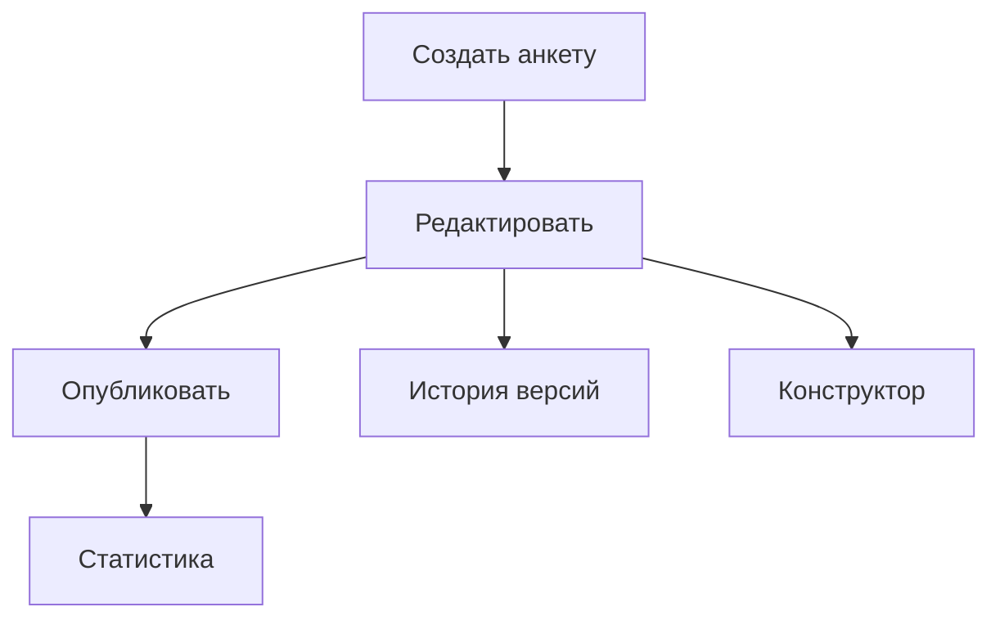
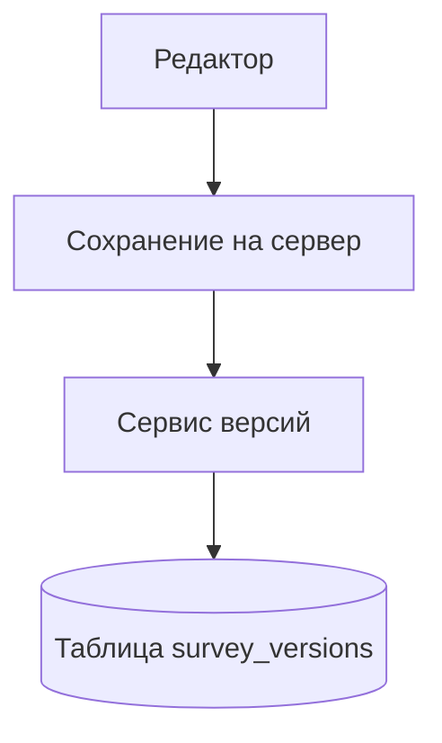
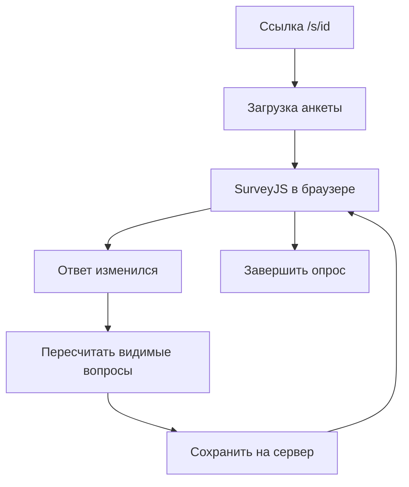
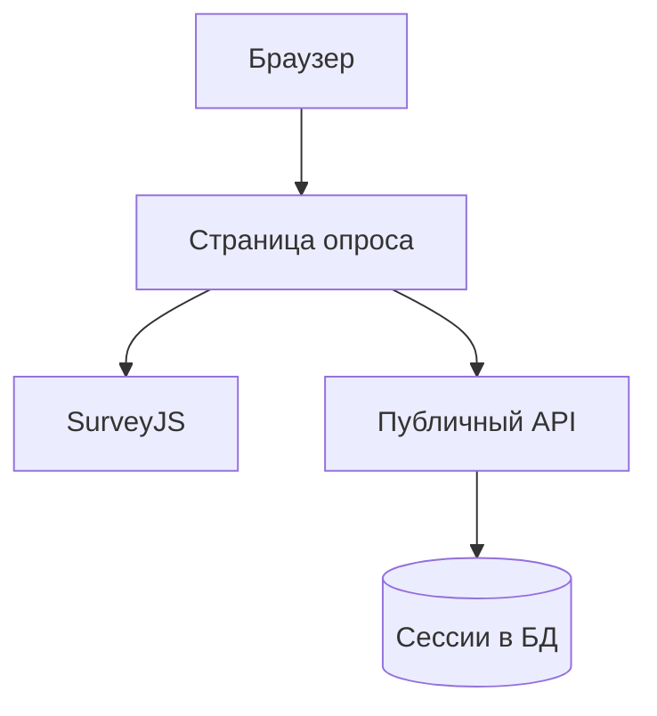
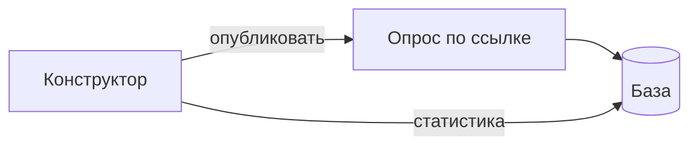

# Презентация к защите ВКР (около 5–6 минут, 8 слайдов + титул)

Один блок «Слайд N» = один слайд. Mermaid → PNG на https://mermaid.live (~1000 px).

**Принцип:** на слайде — смысл простыми словами; термины, API и файлы — в тексте выступления.

---

## Слайд 1. Титул

**На слайде:**

- Выпускная квалификационная работа
- Конструктор и проведение анкетирования
- [ФИО], ННГУ ИИТММ, 2026

**Текст выступления:**

Здравствуйте, меня зовут [ФИО]. Тема работы: подсистема-конструктор и подсистема проведения анкетирования. Реализован прототип на React 19, FastAPI, PostgreSQL, развёртывание через Docker Compose. Дальше покажу две подсистемы, версионирование, динамику при опросе, фрагменты кода и итог.

---

## Слайд 2. Подсистема-конструктор анкетирования

**На слайде:**

- Собрать анкету в редакторе
- Опубликовать и получить ссылку
- Посмотреть ответы и скачать файл

**Диаграмма (прецеденты, из ВКР):**



**Текст выступления:**

Конструктор — для исследователя после входа по JWT. Маршруты вроде `/admin/surveys` и `/admin/surveys/:id`. Список — `AdminSurveysListPage`, редактор — `AdminSurveyEditorPage` с SurveyJS Creator: русская локаль, вкладки дизайна и логики.

Черновик уходит на сервер через `PUT /api/v1/surveys/{id}`: в теле поле `survey_json` в формате SurveyJS, плюс метаданные. Автосохранение на фронте с задержкой около 1 секунды для ролей admin и researcher. Публикация — отдельный `POST .../publish`: выставляется `is_published=true`, появляется публичная ссылка `/s/{uuid}`.

В диалоге настроек задаются сроки (`start_date`, `ends_at` и др.) и `max_responses`, `allow_anonymous`. Статистика — `GET .../stats`, выгрузка — `GET .../export?format=csv` или `json`. Роль student видит только список. Ответы респондентов здесь не вводятся, только подготовка анкеты и контроль.

---

## Слайд 3. Версионирование анкет

**На слайде:**

- Каждое сохранение попадает в журнал
- Видно, что и когда меняли
- Можно вернуть прошлую версию

**Диаграмма:**



**Текст выступления:**

При `update_survey`, если меняется `survey_json` или поля проведения, `SurveyService` увеличивает `version` и вызывает `SurveyVersionService._record_version`. В таблице `survey_versions` лежит снимок `survey_json_snapshot`, номер версии, автор, краткий `change_summary` и структура `changes` (diff через `survey_diff.py`).

В UI — `VersionHistoryPanel` в `ResizableSplitPane` справа от Creator. Восстановление: `POST /surveys/{id}/versions/{version_id}/restore`, на сервере `restore_version` берёт снимок, подставляет в рабочую анкету, снова увеличивает `version` и пишет в журнал `action: restored` с `from_version`. Старая запись не затирается.

Для социологии это важно: если анкету правили во время сбора, в журнале остаётся, какая схема была до правки.

---

## Слайд 4. Динамическое анкетирование

**На слайде:**

- Вопросы зависят от ответов
- Настраивает исследователь
- Работает у респондента в браузере

**Диаграмма:**



**Текст выступления:**

Логика задаётся в Creator: условия `visibleIf`, ветвление, обязательность полей. Всё хранится в одном `survey_json` (JSONB в PostgreSQL). При опросе тот же JSON читает `Model` из survey-core в `PublicSurveyRunPage`: компонент SurveyJS Runner, locale `ru`.

При смене ответа срабатывают `onValueChanged` и `onCurrentPageChanged`. Прогресс и autosave считают только видимые вопросы: `model.getAllQuestions(false)` и фильтр `q.isVisible`. Иначе после скрытия блока процент и `progress_pct` на сервере были бы завышены.

Один формат на редактор и опрос — не нужно поддерживать два разных описания анкеты.

---

## Слайд 5. Подсистема проведения анкетирования

**На слайде:**

- Опрос по ссылке, без пароля
- Ответы сохраняются сами
- Можно продолжить позже в том же браузере

**Диаграмма (из ВКР):**



**Текст выступления:**

Страница `PublicSurveyRunPage`, маршрут `/s/:surveyId`. Публичный API в `public.py`, префикс `/api/v1/public`, без JWT.

Цепочка: `GET /public/surveys/{id}` — только если `is_published` и срок в окне (`SurveyService.get_public_survey`). `POST .../sessions` создаёт строку в `survey_sessions`, UUID кладётся в `localStorage` под ключом `survey_session_{surveyId}`. Дальше `PUT .../sessions/{id}` — autosave с debounce 700 мс: `answers_json`, `current_page`, `progress_pct`. `POST .../complete` ставит `is_completed=true`.

Проверки: лимит завершённых сессий против `max_responses` (403), обязательный `respondent_id` при `allow_anonymous=false` (400), срок при каждом save (403). Возобновление — `GET /public/sessions/{id}` при повторном открытии в том же браузере.

---

## Слайд 6. Пример кода: возврат версии

**На слайде:**

- Код на сервере: откат версии анкеты

**Код:**

```python
async def restore_version(self, survey, version_id, user):
    target = await self.get_version(survey.id, version_id)
    snapshot = target.survey_json_snapshot or {}
    if "survey_json" in snapshot:
        survey.survey_json = snapshot["survey_json"]
    survey.version += 1
    await self._record_version(
        survey,
        changes={"action": "restored", "from_version": target.version_number},
        ...
    )
```

**Текст выступления:**

Фрагмент из `survey_version_service.py`, метод `restore_version`. Сначала загрузка строки из `survey_versions` по `version_id`. Из `survey_json_snapshot` достаётся схема, подставляется в поле `survey.survey_json` рабочей анкеты. Нельзя откатить на ту же версию, что уже текущая — будет 400.

Потом `survey.version += 1` и новая запись в журнал с `changes={"action": "restored", "from_version": ...}`. На фронте это вызывает `restoreSurveyVersion` из `api.ts`, панель `VersionHistoryPanel` с диалогом подтверждения.

---

## Слайд 7. Пример кода: autosave при опросе

**На слайде:**

- Код в браузере: сохранение ответов

**Код:**

```typescript
const visible = model.getAllQuestions(false).filter((q) => q.isVisible);
const pct = ... // сколько из видимых уже заполнено
await api.put(`/public/sessions/${sessionId}`, {
  answers_json: model.data,
  current_page: model.currentPageNo,
  progress_pct: pct,
});
// вызывается через 700 мс после изменения ответа
```

**Текст выступления:**

Из `PublicSurveyRunPage.tsx`, функция `scheduleSave`. В `setTimeout` на 700 мс собирается тело для `PUT /public/sessions/{sessionId}`: `answers_json` из `model.data`, `current_page` из `model.currentPageNo`, `progress_pct` из доли заполненных видимых вопросов.

`getAllQuestions(false)` и `isVisible` — связь с динамикой: скрытый после `visibleIf` вопрос не входит в процент. Хуки `onValueChanged` и `onCurrentPageChanged` вызывают `scheduleSave` после `updateProgress`. На сервере `SessionService.save_progress` валидирует JSON и проверяет, что сессия не завершена.

---

## Слайд 8. Итоги

**На слайде:**

- Конструктор + проведение: полный цикл опроса
- Версии анкеты и умные вопросы
- Спасибо за внимание

**Диаграмма:**



**Текст выступления:**

Цель выполнена: `AdminSurveyEditorPage` + `PublicSurveyRunPage`, общая PostgreSQL (`surveys`, `survey_versions`, `survey_sessions`), REST API, Docker Compose.

Сценарий: Creator → publish → `/s/{id}` → сессии с autosave → stats и export. Главные результаты: журнал версий с diff и restore; динамика через SurveyJS и один `survey_json`. В CI гоняются `e2e_public_flow.py` и `e2e_stats_and_export.py` на urllib.

Ограничение MVP: привязка сессии к `localStorage` одного браузера. В перспективе: JSON с `code` для экранов «опрос не начался» / «срок вышел», сессия по персональной ссылке. Спасибо, готова ответить на вопросы.

---

## Хронометраж

| Слайд | Тема | ~сек |
|-------|------|------|
| 1 | Титул | 30 |
| 2 | Конструктор | 50 |
| 3 | Версионирование | 50 |
| 4 | Динамика | 50 |
| 5 | Проведение | 50 |
| 6 | Код: версии | 35 |
| 7 | Код: autosave | 35 |
| 8 | Итоги | 40 |
| **Σ** | | **~5:40** |

---

## Если спросят

**Версия и сессия?** `survey_versions` — схема анкеты. `survey_sessions` — ответы одного прохождения.

**Почему SurveyJS?** Creator и Runner, общий `survey_json`.

**Демо?** `docker compose up`, `/admin/surveys`, publish, `/s/{uuid}` в другой вкладке.
