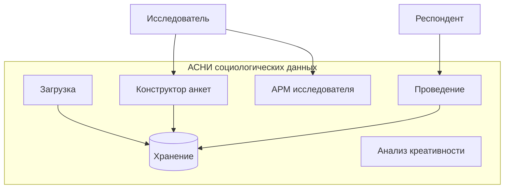
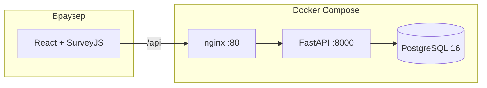
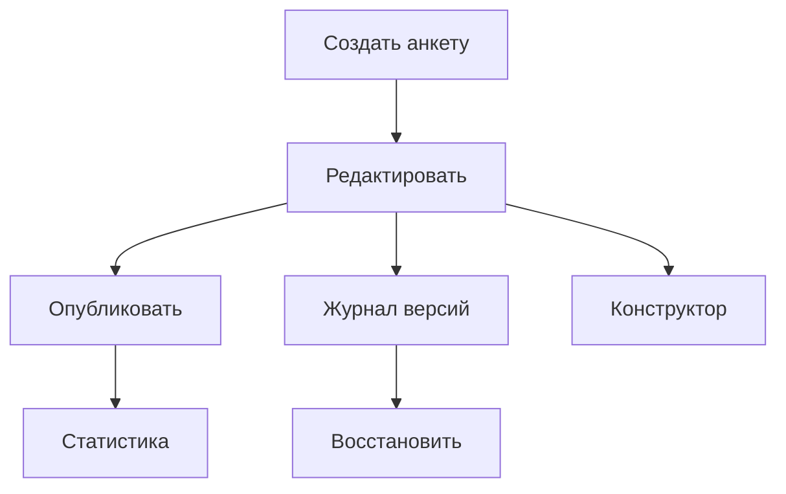
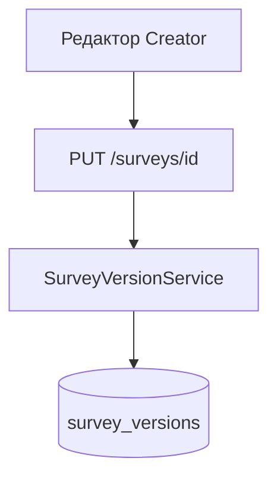
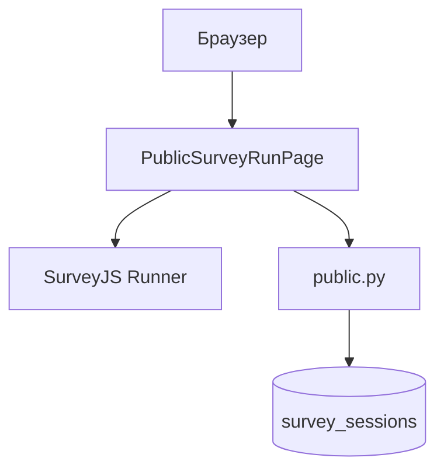
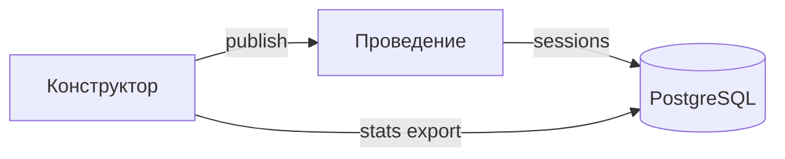

# Презентация к защите ВКР (≈5 минут, 10 слайдов)

Сервис конструктора и проведения анкетирования в АСНИ социологических данных.

Как перенести в PowerPoint / Google Slides: один раздел = один слайд. Диаграммы Mermaid вставьте как PNG с https://mermaid.live (ширина 900–1100 px). Код — скриншот с моноширинным шрифтом 14–16 pt.

---

## Слайд 1. Титул

**На слайде (мало текста):**

- Выпускная квалификационная работа
- Подсистемы конструктора и проведения анкетирования в АСНИ социологических данных
- ФИО, группа, ННГУ, год

**Текст выступления (~25 с):**

Здравствуйте. Тема работы — две подсистемы АСНИ: конструктор анкет для исследователя и проведение для респондента. Реализован рабочий прототип на React, FastAPI и PostgreSQL, упакованный в Docker. Дальше покажу, как устроено решение и в чём его практическая ценность.

---

## Слайд 2. Место в АСНИ

**На слайде:**

- АСНИ: 6 подсистем
- В работе: **конструктор** + **проведение**
- Общая БД PostgreSQL

**Диаграмма (новая, компактная):**



**Текст выступления (~30 с):**

АСНИ задумана как единый контур от проектирования опроса до анализа. В моей ВКР полностью реализованы конструктор и проведение: первая собирает и публикует анкету, вторая отдаёт её респонденту по ссылке и пишет ответы в ту же базу. Остальные подсистемы в записке описаны на уровне архитектуры.

---

## Слайд 3. Архитектура прототипа

**На слайде:**

- Docker Compose: `survey-db`, `survey-api`, `survey-frontend`
- JWT: admin / researcher / student
- Module Federation: встраивание в оболочку АСНИ

**Диаграмма:**



**Текст выступления (~30 с):**

Стек трёх контейнеров. PostgreSQL хранит анкеты в JSONB, журнал версий и сессии респондентов. Backend на FastAPI с асинхронным SQLAlchemy. Frontend — React 19, SurveyJS Creator и Runner. Nginx в production отдаёт SPA и проксирует API на один origin. Тот же фронт можно подключить к родительской системе АСНИ как remote `surveyConstructor`.

---

## Слайд 4. Подсистема-конструктор

**На слайде:**

- SurveyJS Creator, русская локаль
- Публикация → ссылка `/s/{id}`
- Статистика и экспорт CSV/JSON

**Диаграмма (из ВКР, рис. 2.1):**



**Текст выступления (~35 с):**

Исследователь без кода собирает анкету в Creator: страницы, типы вопросов, вкладка «Логика». Черновик автосохраняется примерно раз в секунду. Одна кнопка публикации — после неё анкета доступна по публичной ссылке. В интерфейсе есть журнал версий, сводка по сессиям и выгрузка ответов. Роль student видит только список, без редактирования.

---

## Слайд 5. Преимущество: версионирование анкет

**На слайде (крупно):**

- Каждое сохранение → снимок `survey_json` в `survey_versions`
- Diff изменений, откат с подтверждением
- Откат не затирает историю: новая версия с `action: restored`

**Диаграмма (из ВКР, рис. 2.3, фрагмент):**



**Текст выступления (~40 с):**

Это одно из главных отличий прототипа от «просто формы в Google». При каждом изменении схемы сервер увеличивает номер версии и пишет снимок в журнал: кто правил, когда, краткое описание diff. В панели справа исследователь видит список ревизий и может восстановить любую — с диалогом подтверждения. Текущее состояние перед откатом тоже сохраняется как новая запись. Для социологии это страховка: опрос меняли в процессе поля — сырые данные и схема на момент сбора не смешиваются бесследно.

---

## Слайд 6. Преимущество: динамическое анкетирование

**На слайде:**

- Логика SurveyJS: `visibleIf`, ветвление
- Исполнение на клиенте (Runner)
- Прогресс только по **видимым** вопросам

**Диаграмма (из ВКР, рис. 3.2, укороченная):**

```mermaid
flowchart TD
    A[/s/id] --> B[GET анкета + survey_json]
    B --> C[SurveyJS Runner]
    C --> D{Ответ изменился}
    D --> E[Пересчёт видимых вопросов]
    E --> F[Autosave PUT]
    F --> C
    C --> G[POST complete]
```

**Пример на слайде (1 строка JSON, мелко):**

`"visibleIf": "{q1} = 'да'"`

**Текст выступления (~40 с):**

Второе ключевое преимущество — динамика на стороне респондента. Условия показа задаёт исследователь в Creator; Runner на клиенте скрывает и показывает страницы без перезагрузки. При смене ответа пересчитывается не вся анкета, а только видимые вопросы — от этого зависит процент прогресса и то, что уходит на сервер. Один JSON `survey_json` одинаково читает Creator при редактировании и Runner при опросе — нет двух расходящихся форматов.

---

## Слайд 7. Подсистема проведения

**На слайде:**

- Публичная ссылка, без JWT
- Сессия + localStorage
- Autosave 700 мс, возобновление с той же страницы

**Диаграмма (из ВКР, рис. 3.3):**



**Текст выступления (~35 с):**

Респондент открывает `/s/{uuid}`. Сервер отдаёт анкету только если она опубликована и в окне сроков. Создаётся сессия, id лежит в localStorage — можно закрыть вкладку и продолжить в том же браузере. Каждое изменение ответа через 700 миллисекунд уходит PUT с ответами, номером страницы и прогрессом. По завершении — POST complete, сессия закрыта для правок. Проверяются лимит ответов и запрет анонимного прохождения.

---

## Слайд 8. Пример кода: версионирование

**На слайде:** заголовок + фрагмент (12–15 строк)

**Код (backend, `survey_version_service.py`):**

```python
async def restore_version(self, survey, version_id, user):
    target = await self.get_version(survey.id, version_id)
    snapshot = target.survey_json_snapshot or {}
    if target.version_number == survey.version:
        raise HTTPException(400, "Cannot restore the current version")
    if "survey_json" in snapshot:
        survey.survey_json = snapshot["survey_json"]
    survey.version += 1
    await self._record_version(
        survey,
        changes={"action": "restored", "from_version": target.version_number},
        editor_name=_editor_name(user),
        ...
    )
```

**Текст выступления (~30 с):**

На сервере восстановление — не «откат файла», а новая ревизия. Берём снимок из `survey_versions`, подставляем в рабочую анкету, увеличиваем version и пишем в журнал событие restored с номером источника. Так в аудите видно и что вернули, и что было до отката.

---

## Слайд 9. Пример кода: динамика и autosave

**На слайде:** заголовок + фрагмент

**Код (frontend, `PublicSurveyRunPage.tsx`):**

```typescript
function scheduleSave(sessionId: string) {
  saveTimer.current = window.setTimeout(async () => {
    const visible = model.getAllQuestions(false).filter((q) => q.isVisible);
    const pct = visible.length
      ? Math.round((visible.filter((q) => !q.isEmpty()).length / visible.length) * 100)
      : 0;
    await api.put(`/public/sessions/${sessionId}`, {
      answers_json: model.data,
      current_page: model.currentPageNo,
      progress_pct: pct,
    });
  }, 700);
}
model.onValueChanged.add(() => { updateProgress(); scheduleSave(sessionId); });
```

**Текст выступления (~30 с):**

Здесь связаны динамика и сохранение. `getAllQuestions(false)` — только видимые после срабатывания `visibleIf`. Прогресс и тело PUT считаются от них же. Debounce 700 мс снижает число запросов, но ответы не теряются при обычном темпе заполнения.

---

## Слайд 10. Результаты и выводы

**На слайде:**

- Прототип: редактор → публикация → опрос → статистика/экспорт
- E2E-тесты API в CI
- Плюсы: **версионирование**, **динамические анкеты**, единый JSON SurveyJS
- Ограничение MVP: сессия привязана к браузеру

**Диаграмма (итоговый поток):**



**Текст выступления (~35 с):**

В итоге замкнутый цикл: собрали анкету с ветвлением, опубликовали, собрали ответы с автосохранением, посмотрели статистику и выгрузили CSV или JSON. Версионирование защищает методику при правках схемы; динамика на Runner даёт адекватный опыт респонденту без программиста на каждый опрос. В перспективе — доработка кодов ошибок API для экранов «ещё не началось» и переносимых сессий по токену. Спасибо за внимание, готов ответить на вопросы.

---

## Хронометраж (≈5 мин)

| Слайд | Тема              | Секунд |
|-------|-------------------|--------|
| 1     | Титул             | 25     |
| 2     | АСНИ              | 30     |
| 3     | Архитектура       | 30     |
| 4     | Конструктор       | 35     |
| 5     | Версионирование   | 40     |
| 6     | Динамика          | 40     |
| 7     | Проведение        | 35     |
| 8     | Код: версии       | 30     |
| 9     | Код: autosave     | 30     |
| 10    | Итоги             | 35     |
| **Σ** |                   | **~330** (~5:30; при необходимости урежьте слайды 2 и 3 на 15 с) |

---

## Подсказки для защиты

- **Демо (если спросят):** `docker compose up`, админка `/admin/surveys`, публикация, ссылка `/s/{id}`, одно ветвление в Creator (вопрос B только если в A выбран «да»).
- **Вопрос про версии vs сессии:** версии — схема анкеты (`survey_versions`); сессии — ответы респондентов (`survey_sessions`).
- **Вопрос про SurveyJS:** Creator и Runner из одной экосистемы; `survey_json` — общий контракт между подсистемами.
